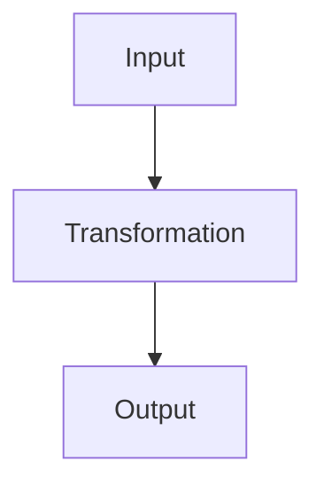
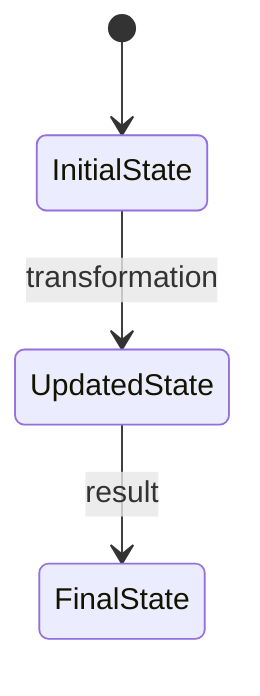
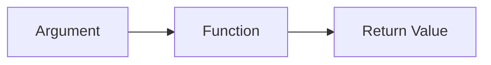
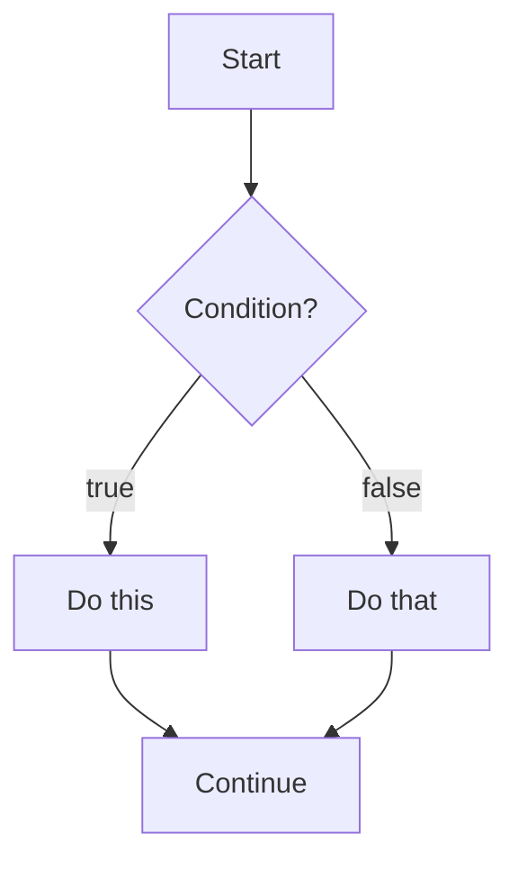
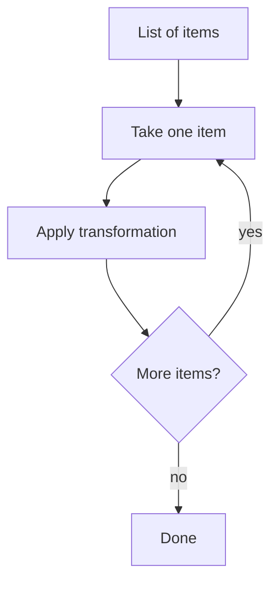
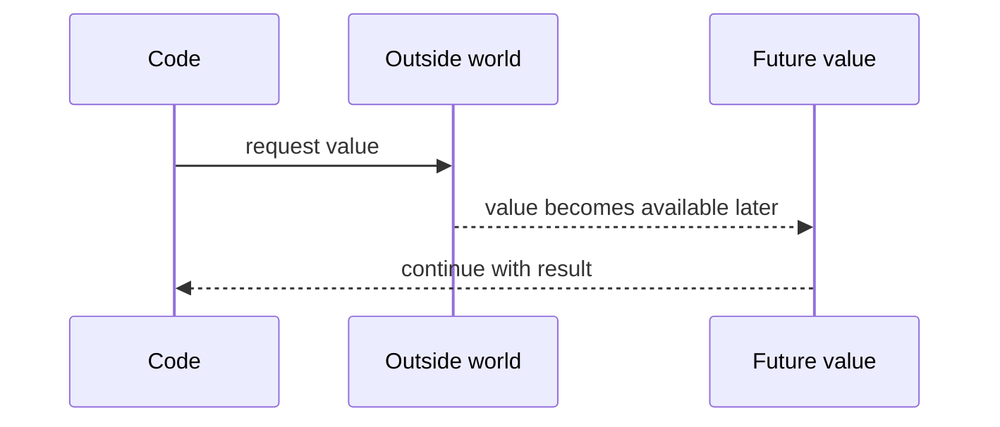
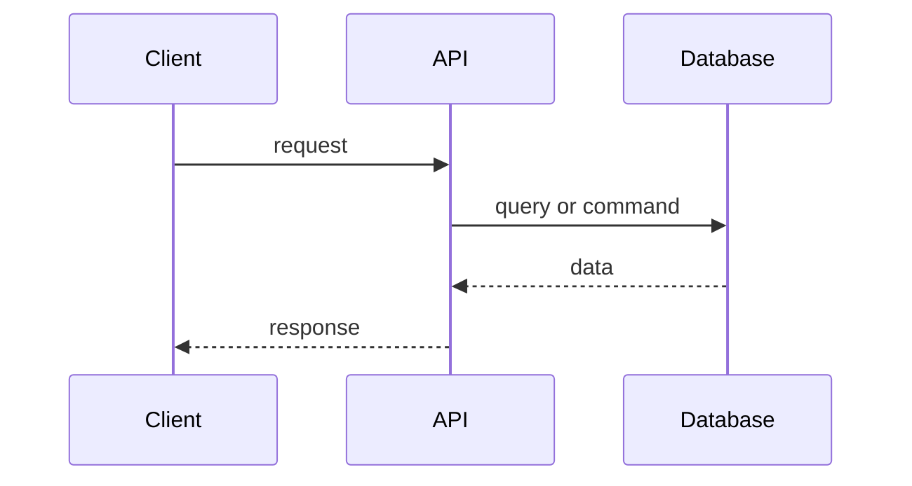
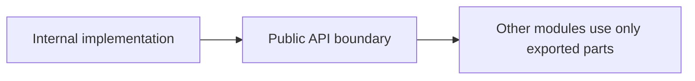
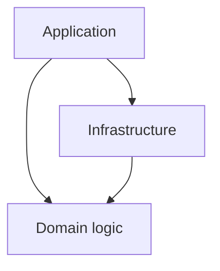
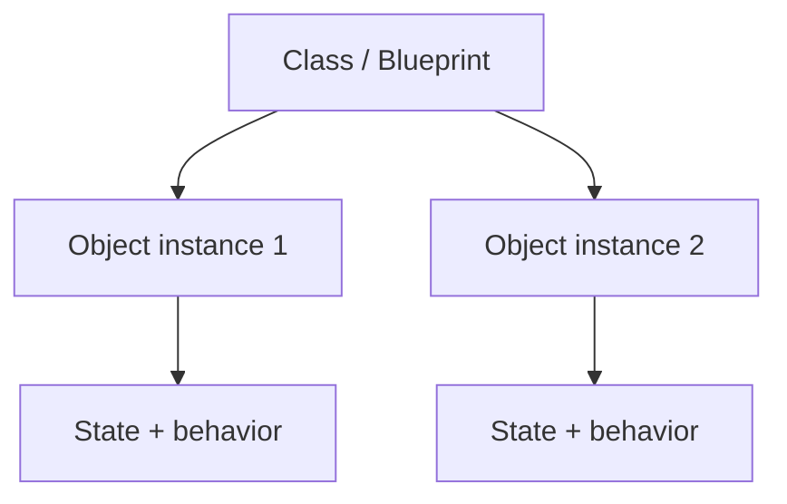

# Mermaid Patterns for Learning Notes

Use these as reusable diagram patterns.

Do not include all of them in every note.

Choose only the diagram that clarifies the concept.

---

## Input → Transformation → Output

Use for functions, APIs, parsing, data processing, and general programming concepts.

---

## State transition

Use for variables, objects, reducers, UI state, databases, and programs over time.

---

## Function call

Use for understanding parameters, return values, and reusable behavior.

---

## Control flow

Use for conditionals, branching, guards, validation, and decision logic.

---

## Loop / iteration

Use for loops, mapping, filtering, database iteration, and repeated transformations.

---

## Promise / async value

Use for promises, async/await, network calls, and values that arrive later.

---

## Request / response

Use for APIs, servers, clients, databases, and web apps.

---

## Module boundary

Use for imports, exports, packages, monorepos, public APIs, and architecture.

---

## Dependency direction

Use for architecture and package boundaries.

---

## Object / class relationship

Use for classes, objects, blueprints, instances, and grouped state.

