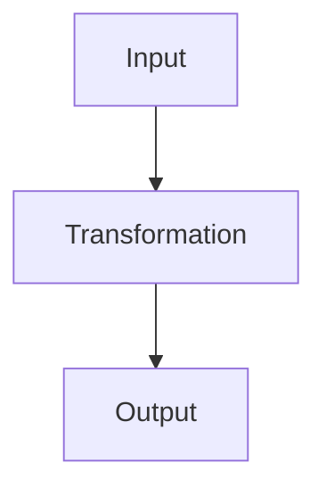

---
title: "<Topic>"
type: "core-logic-note"
created: "YYYY-MM-DD"
skills:
  - core-logic-learning
---

# <Topic>

> Syntax is not knowledge. Mental models are knowledge.

## The problem this concept solves

What problem existed before this concept?

Why was this concept invented?

What becomes painful, repetitive, unclear, or impossible without it?

## The core mental model

What is the smallest stable idea underneath the topic?

Explain the concept without starting from syntax.

## State and transformations

What state exists?

What changes over time?

What causes the change?

Example shape:

```text
old state
↓ transformation
new state
```

## Information flow

What goes in?

What transformation happens?

What comes out?

Example shape:

```text
input
↓
transformation
↓
output
```

## Visual model

Use this section only when a diagram makes the concept easier to understand.

Example:



## Pattern recognition

What larger pattern does this belong to?

What old thing is this really?

Examples:

- a loop is iteration
- a promise is a value that arrives later
- a function is a reusable transformation
- an object is grouped state plus behavior
- an API is a boundary for requesting capabilities

## Syntax mapping

Now map the concept to syntax.

Show how the language represents the deeper idea.

```ts
// example here
```

## Code example

Use a small example that proves the model.

```ts
// example here
```

Explain the code through:

1. state
2. transformation
3. information flow
4. pattern

## Beginner traps

Where does the shallow explanation break?

What fake intuition should be avoided?

What does a beginner usually memorize instead of understanding?

## Real-world usage

How does this appear in real projects, production code, or larger systems?

If this is not a production-focused note, keep this section short.

If this is a production-focused note, include real patterns and tradeoffs.

## Practice task

Give one small task that forces active use of the concept.

The task should be small enough to do now.

## Summary

What should I remember?

What could I re-derive if I forgot the syntax?

What is the compressed mental model?
