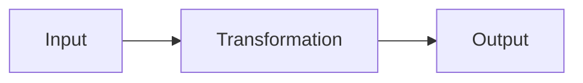
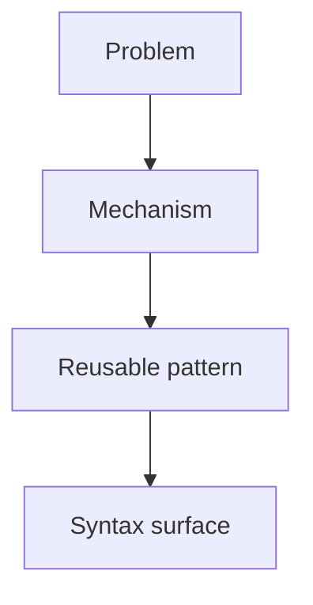
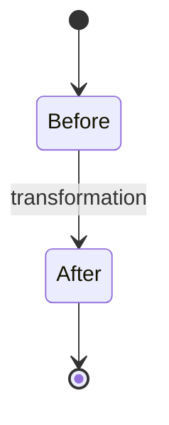
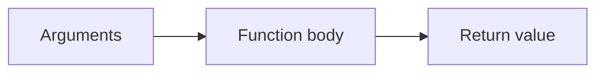
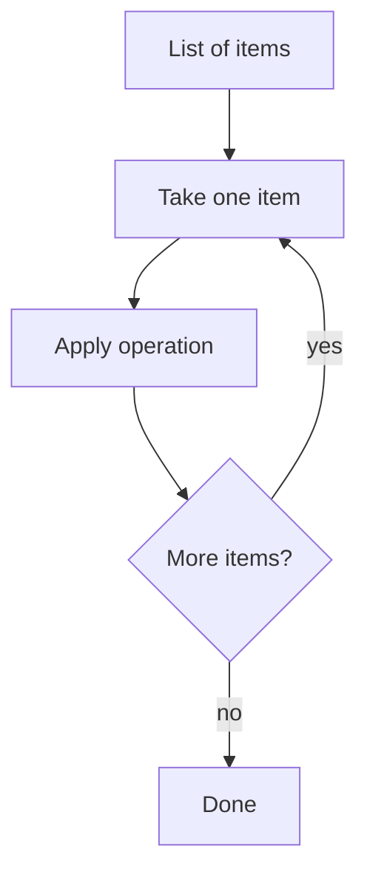
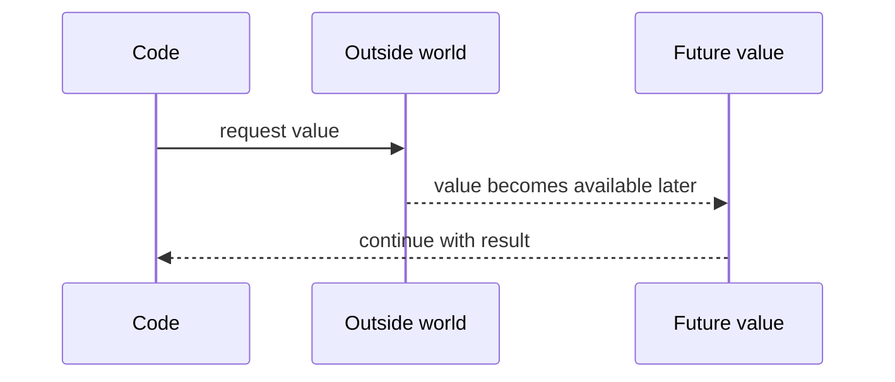
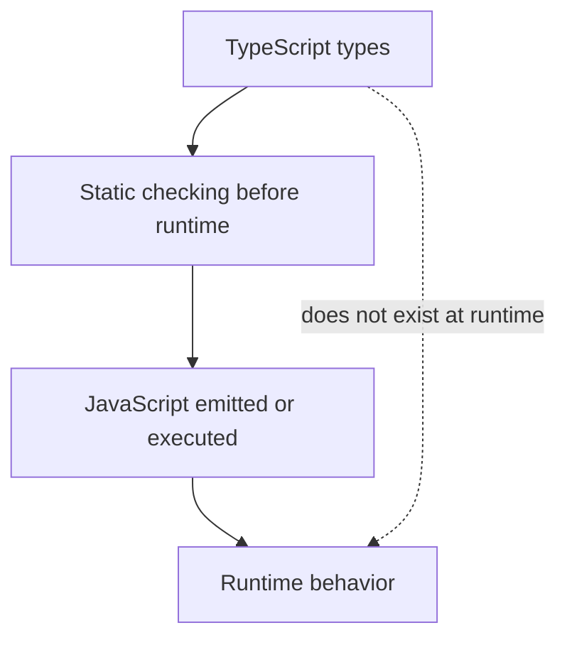
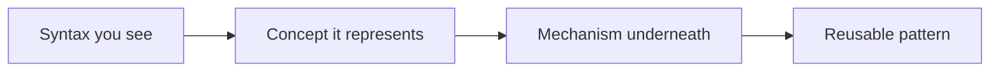
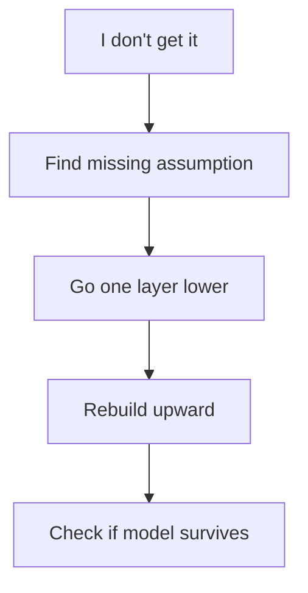
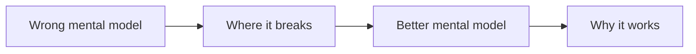

# Learning Mermaid Templates

<template_library>

<purpose>
Use these templates for Core Logic learning notes.

Do not copy them blindly. Adapt labels to the actual concept.
</purpose>

<template name="input_transformation_output" diagram_type="flowchart LR">

Use for functions, parsers, APIs, data transforms, and general programming concepts.

</template>

<template name="problem_concept_syntax" diagram_type="flowchart TD">

Use when teaching that syntax is surface representation.

</template>

<template name="state_transformation" diagram_type="stateDiagram-v2">

Use for variables, objects, reducers, UI state, and mutation.

</template>

<template name="function_call_flow" diagram_type="flowchart LR">

Use for function basics.

</template>

<template name="loop_iteration" diagram_type="flowchart TD">

Use for loops, map, filter, reduce, database iteration, and stream processing.

</template>

<template name="promise_value_later" diagram_type="sequenceDiagram">

Use for promises, async/await, network requests, timers, and file reads.

</template>

<template name="runtime_vs_typescript_compile_time" diagram_type="flowchart TD">

Use for TypeScript-only concepts.

</template>

<template name="syntax_to_mental_model" diagram_type="flowchart LR">

Use whenever syntax feels arbitrary.

</template>

<template name="missing_assumption_drilldown" diagram_type="flowchart TD">

Use for confusion notes and debugging the learner's mental model.

</template>

<template name="wrong_model_better_model" diagram_type="flowchart LR">

Use when the note should show why a beginner mental model fails.

</template>

</template_library>
