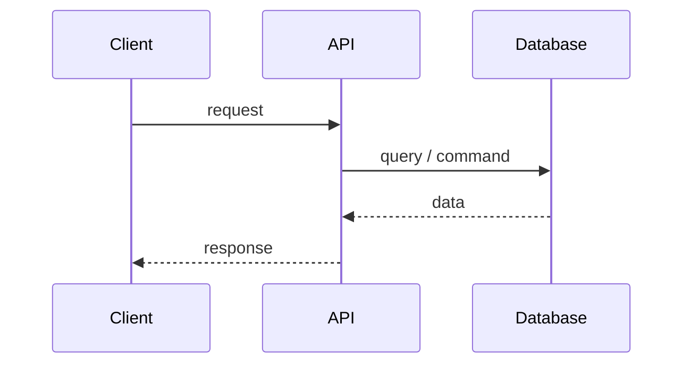
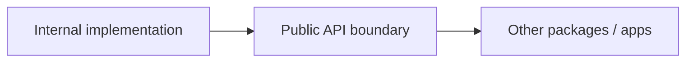
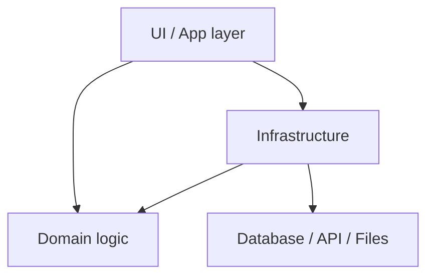
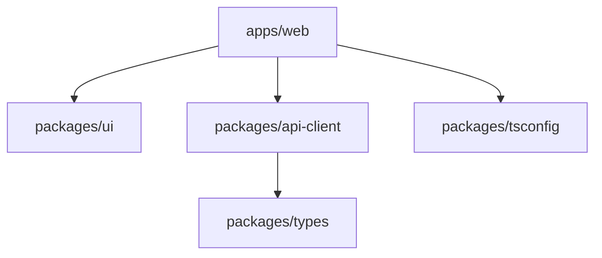
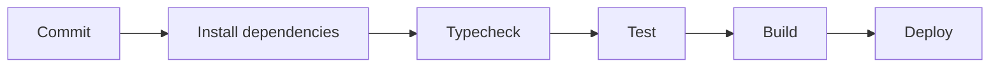
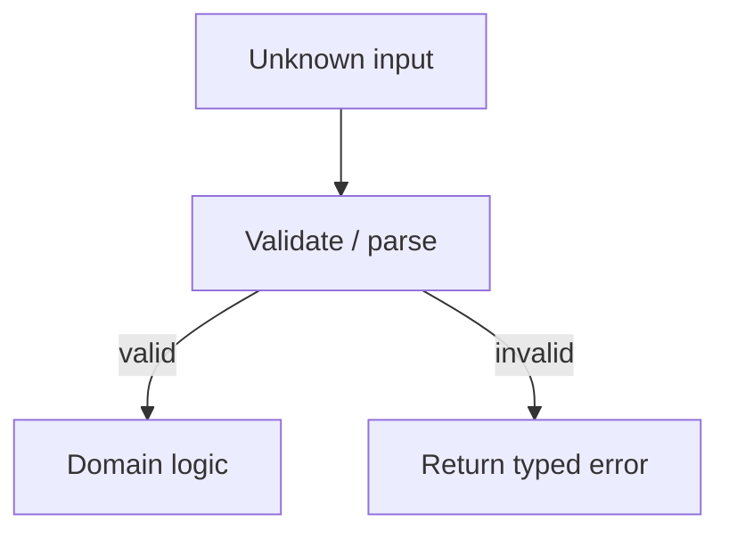
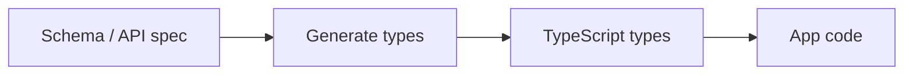
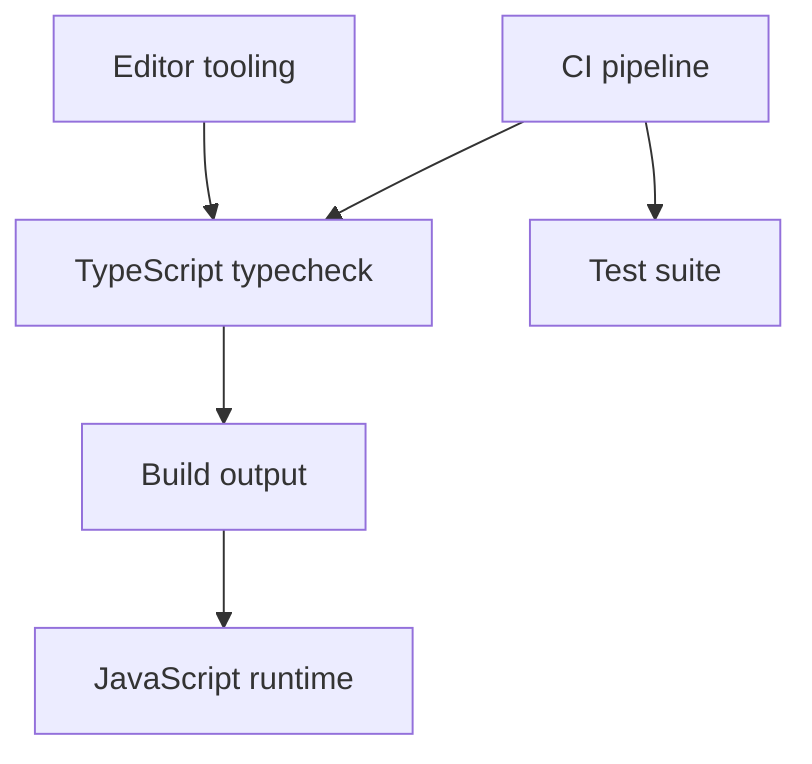

# Software Architecture Mermaid Templates

<template_library>

<purpose>
Use these templates for real-world, enterprise, and production TypeScript notes.

The diagram must explain a system boundary, dependency direction, request flow, build flow, or architectural tradeoff.
</purpose>

<template name="client_api_database" diagram_type="sequenceDiagram">

Use for web apps, backend APIs, and request/response flows.

</template>

<template name="package_boundary" diagram_type="flowchart LR">

Use for package exports, public APIs, and monorepo packages.

</template>

<template name="layered_architecture" diagram_type="flowchart TD">

Use to discuss dependencies, boundaries, and why layers exist.

</template>

<template name="monorepo_package_graph" diagram_type="flowchart TD">

Use for TypeScript monorepos.

</template>

<template name="build_ci_flow" diagram_type="flowchart LR">

Use for production pipelines.

</template>

<template name="validation_boundary" diagram_type="flowchart TD">

Use for Zod, APIs, boundary parsing, and unknown input.

</template>

<template name="type_generation_flow" diagram_type="flowchart LR">

Use for OpenAPI, Prisma, GraphQL, generated SDKs, and schema-driven systems.

</template>

<template name="runtime_tooling_boundary" diagram_type="flowchart TD">

Use when separating editor checks, CI checks, build output, and runtime behavior.

</template>

</template_library>
