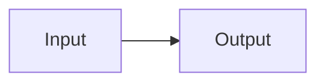

# Mermaid Source Index

<source_contract>

<purpose>
Use this file as a research map for Mermaid inspiration.

Do not blindly copy templates. Extract patterns and rewrite them for the user's Core Logic system.
</purpose>

<official_sources>
Prefer these source categories first:

- Mermaid official syntax reference
- Mermaid official examples
- Mermaid Live Editor
- Mermaid GitHub repository
</official_sources>

<markdown_rendering>
For Markdown notes, use fenced code blocks with the `mermaid` language tag.

This is the standard shape:

````md

````
</markdown_rendering>

<template_sources>
Use public template galleries only for inspiration.

Good categories to search:

- Mermaid template galleries
- Mermaid example repositories
- architecture diagrams in Markdown
- sequence diagram examples
- flowchart examples
- Mermaid diagrams in GitHub READMEs
</template_sources>

<license_rule>
Do not copy licensed material blindly.

Allowed behavior:

- learn diagram patterns
- rewrite labels and structures
- adapt ideas to the user's project
- cite sources when doing research

Avoid:

- pasting large third-party template collections verbatim
- copying copyrighted documentation wholesale
</license_rule>

</source_contract>
