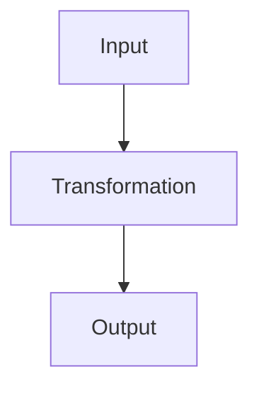
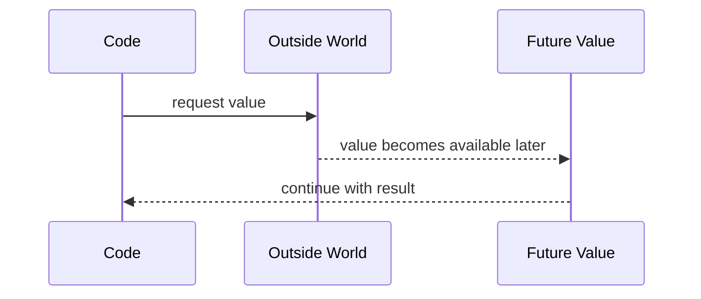
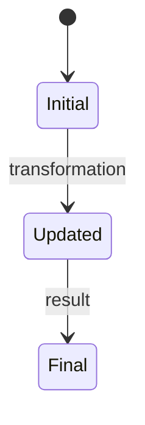

# Diagrams and Markdown Preview

Use this file when you want notes to look good in Zed.

## Where Beautiful Output Goes

Beautiful explanations should go into:

```text
notes/
```

Examples:

```text
notes/concepts/functions-core-logic.md
notes/production/generics-production-patterns.md
notes/exercises/functions-practice.md
```

## How To Preview Markdown

Open a `.md` note.

Press:

```text
Ctrl + Shift + V
```

That opens Markdown preview to the side.

Use preview for:

```text
notes/*.md
learning-chat.md
README.md
WORKFLOW.md
CHEATSHEET.md
```

Do not worry about previewing these beautifully:

```text
.ai-rules/*.md
.agents/skills/*/SKILL.md
```

Those are operational files for Codex.

## Code Blocks

Code should be written with language labels.

Good:

```ts
function double(x: number) {
  return x * 2
}
```

Good terminal block:

```powershell
git status
```

Good JSON block:

```json
{
  "strict": true
}
```

This makes Zed show syntax highlighting.

## When To Use Mermaid Diagrams

Use Mermaid when the concept has movement, flow, or structure.

Good use cases:

```text
input → transformation → output
state changes over time
async / promises
request / response
module boundaries
dependency direction
control flow
loops / iteration
```

Do not use Mermaid just because it looks cool.

Use it only when it makes the idea easier to understand.

## Mermaid Example



## Promise / Async Diagram



## State Diagram



## Simple Rule

If the idea is about **flow**, **state**, or **relationships**, a diagram may help.

If the idea is mostly a definition or small syntax mapping, use text or code instead.
