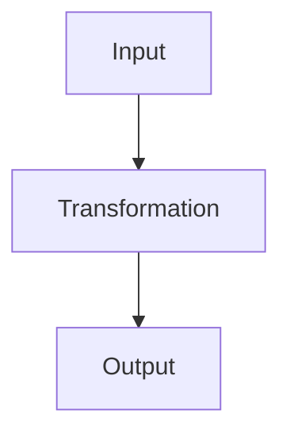
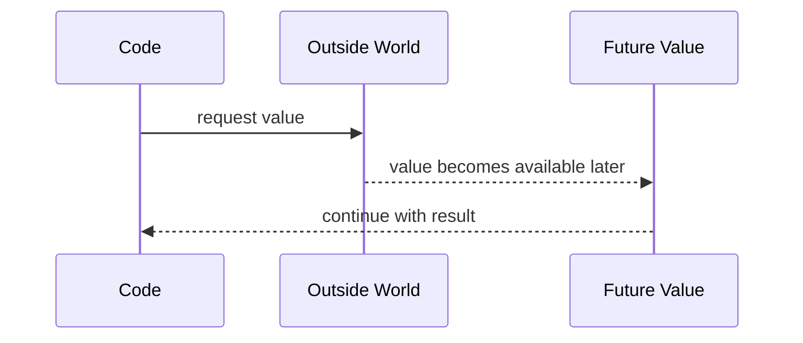

# Diagrams and Markdown Preview

Use this file when you want notes to look good in Zed.

## Where beautiful output goes

Beautiful explanations should go into:

```text
notes/
```

Examples:

```text
notes/concepts/functions-core-logic.md
notes/production/generics-production-patterns.md
notes/exercises/functions-practice.md
```

## Preview Markdown

Open a `.md` note.

Press:

```text
Ctrl + Shift + V
```

That opens Markdown preview to the side.

Use preview for:

```text
notes/*.md
learning-chat.md
README.md
WORKFLOW.md
CHEATSHEET.md
```

Do not worry about previewing these beautifully:

```text
.ai-rules/*.md
.agents/skills/*/SKILL.md
```

Those are operational files for Codex.

## Code blocks

Code should be written with language labels.

```ts
function double(x: number) {
  return x * 2
}
```

```powershell
git status
```

```json
{
  "strict": true
}
```

This makes Zed show syntax highlighting.

## When to use Mermaid diagrams

Use Mermaid when the concept has movement, flow, or structure:

- input → transformation → output,
- state changes over time,
- async / promises,
- request / response,
- module boundaries,
- dependency direction,
- control flow,
- loops / iteration.

Do not use Mermaid just because it looks cool.

Use it only when it makes the idea easier to understand.

## Mermaid example



## Promise / async diagram


