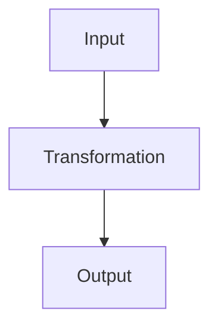

# Core Logic Playground Workflow

This file explains how to use the Core Logic Learning setup in Zed + Codex.

The goal is simple:

```text
Codex terminal = conversation / control
Zed editor = writing + reading + reviewing
.ai-rules/ = deep learning operating system
.agents/skills/ = task modes
notes/ = polished web-like Markdown lessons
src/ = practice code
Git = safety, diff review, rollback
```

---

## 1. Project map

```text
core-logic-playground/
│
├── AGENTS.md
│   Always-on router for Codex.
│
├── .ai-rules/
│   Core Logic Learning OS.
│   This is the deep teaching brain.
│
├── .agents/
│   └── skills/
│       ├── core-logic-learning/
│       │   Deep first-principles teaching.
│       │
│       ├── enterprise-typescript-research/
│       │   Production / real-world TypeScript research.
│       │
│       └── learning-note-writer/
│           Creates polished Markdown notes.
│
├── notes/
│   Polished standalone lessons.
│
├── learning-chat.md
│   Ongoing journal / rough session notes.
│
└── src/
    Practice code and exercises.
```

---

## 2. What each layer does

### `AGENTS.md`

This is the always-on project router.

Codex should read it before working and use it to understand:

- this is a learning workspace,
- `.ai-rules/` is active teaching protocol,
- skills exist,
- explanations should not be syntax-first,
- notes should be written into `notes/` when requested.

Keep `AGENTS.md` short. Do not put the whole system there.

### `.ai-rules/`

This is the Core Logic Learning OS.

It contains the actual teaching logic:

- syntax is not knowledge,
- mental models are knowledge,
- use purpose / machine / information / pattern / evolution / reality lenses,
- drill down when confused,
- avoid fake intuition,
- derive instead of memorize.

These files are operational. They do not need to look pretty in Markdown preview.

### `.agents/skills/`

Skills are task modes.

Use them explicitly in Codex with `$skill-name`.

The three main skills:

```text
$core-logic-learning
= teach concepts from first principles

$enterprise-typescript-research
= show production / real-world TypeScript usage

$learning-note-writer
= create polished Markdown notes
```

### `notes/`

This is where beautiful final lessons go.

Examples:

```text
notes/concepts/functions-core-logic.md
notes/concepts/promises-later-values.md
notes/production/generics-production-patterns.md
notes/exercises/functions-practice.md
```

### `learning-chat.md`

This is the ongoing journal.

Use it for:

- rough session notes,
- questions,
- partial explanations,
- links to polished notes,
- “I don't get it” threads.

### `src/`

This is where exercises and TypeScript experiments go.

Use it for real code, not explanations.

---

## 3. Daily startup workflow

Open the project in Zed.

Then open the terminal in the project root:

```powershell
cd C:\Users\muell\core-logic-playground
git status
codex
```

For live web / repo research:

```powershell
codex --search
```

Good first message:

```text
Read AGENTS.md.

Use the Core Logic Learning OS for this session.

When I use a skill, follow that skill's SKILL.md and relevant references.

Before doing big file edits, tell me the planned files.
```

---

## 4. Normal concept learning

Use this when you want to understand something deeply:

```text
$core-logic-learning

Teach me TypeScript functions from first principles.
Do not teach syntax first.
```

Use this when you want Codex to explain a file:

```text
$core-logic-learning

Read src/main.ts and explain what is happening through:
- purpose
- state
- transformations
- information flow
- pattern
- syntax mapping
```

---

## 5. Confusion workflow

When something does not click, do not ask for “another explanation.”

Ask Codex to go lower:

```text
$core-logic-learning

I don't get promises.
Find the missing lower assumption.
Go one abstraction layer lower and rebuild upward.
Do not merely rephrase.
```

If you want this saved:

```text
$core-logic-learning
$learning-note-writer

I don't get promises.
Find the missing lower assumption.
Write the explanation into learning-chat.md under a new section called "Promises".
```

---

## 6. Polished note workflow

Use this when terminal output would be ugly and you want a real saved lesson.

```text
$core-logic-learning
$learning-note-writer

Teach me TypeScript functions from first principles.

Create a polished Markdown note at:

notes/concepts/functions-core-logic.md

Use Mermaid only if it genuinely helps.
Use fenced code blocks with language labels.
Update notes/index.md.
```

Then open the created note in Zed and use Markdown preview.

---

## 7. Production / enterprise workflow

Use this only when you want real-world usage.

If the topic needs fresh repos or current docs, start Codex with:

```powershell
codex --search
```

Then ask:

```text
$enterprise-typescript-research
$learning-note-writer

How do production TypeScript repos use generics in real code?

Use mature repos like Bluesky, VS Code, TypeScript, Prisma, or other strong examples if useful.

Create a polished note at:

notes/production/generics-production-patterns.md

Explain:
1. What beginners learn.
2. What production teams need.
3. Real repo examples.
4. Repeated pattern.
5. Tradeoffs.
6. Core Logic explanation.
7. What I should practice next.

Update notes/index.md.
```

---

## 8. Search mode: normal Codex vs `codex --search`

There are two search levels:

```text
codex
= normal interactive session
= cached web search may be available

codex --search
= live web search for freshest data
```

Use normal `codex` for:

- learning,
- local code,
- notes,
- exercises,
- old/stable concepts.

Use `codex --search` for:

- latest package versions,
- current docs,
- real repo research,
- “how do production teams do this today?”,
- enterprise / real-world examples.

If you are already inside normal Codex and need web research, ask:

```text
Use web search if available.
If only cached search is available and live/current data is needed, tell me to restart with codex --search.
```

If you always want live web search, you can configure Codex with:

```toml
web_search = "live"
```

But live web data is untrusted. For research, ask Codex to cite sources and separate evidence from inference.

---

## 9. Book / course material workflow

If you add another book or course, use Markdown chapters when possible.

Recommended local structure:

```text
local-sources/
  total-typescript/
    chapter-01.md
    chapter-02.md
    ...
```

or:

```text
sources/
  my-own-material/
    chapter-01.md
```

Use `local-sources/` for private or paid content that should not be pushed to GitHub.

Add private material to `.gitignore`:

```gitignore
local-sources/
total-typescript/
Total TypeScript/
book/
chapters/
*.pdf
```

Ask Codex:

```text
$core-logic-learning
$learning-note-writer

Read local-sources/total-typescript/chapter-01.md.

Teach the chapter through the Core Logic method.
Create a polished note at notes/concepts/<topic>.md.
Do not copy the chapter. Extract the mental model.
```

For enterprise comparison:

```text
$enterprise-typescript-research
$learning-note-writer

Compare the concept from local-sources/total-typescript/chapter-01.md with how production TypeScript repos use it.

Create a note at notes/production/<topic>-production-patterns.md.
```

---

## 10. Practice workflow

Ask Codex to create an exercise without solving it:

```text
$core-logic-learning

Create a small unsolved TypeScript exercise in src/main.ts for functions.

Do not solve it yet.

After I try, review my solution through:
- state
- transformations
- information flow
- pattern
- beginner trap
```

After you try the exercise:

```text
$core-logic-learning

Review src/main.ts.

Explain what I misunderstood, not only what syntax is wrong.

Then suggest one smaller practice task.
```

---

## 11. Markdown preview in Zed

Use Markdown preview for:

```text
notes/*.md
learning-chat.md
README.md
WORKFLOW.md
```

Do not worry about pretty preview for:

```text
.ai-rules/*.md
.agents/skills/*/SKILL.md
```

Those are operational files for agents.

### Recommended Markdown preview hotkeys

```text
Ctrl + Shift + V
= Open Markdown preview to the side

Ctrl + Alt + V
= Open Markdown preview for current file

Ctrl + Alt + Shift + V
= Open following preview
```

“Following preview” means the preview pane follows/syncs with the active Markdown editor.

Use this most of the time:

```text
Ctrl + Shift + V
```

---

## 12. Recommended Zed keymap

Open Zed keymap:

```text
Ctrl + Shift + P
zed: open keymap
```

Recommended useful bindings:

```json
[
  {
    "context": "Workspace",
    "bindings": {
      "ctrl-shift-g": "git_panel::ToggleFocus",
      "ctrl-alt-d": "git::Diff",
      "ctrl-alt-a": "agent::OpenAgentDiff",
      "ctrl-`": "terminal_panel::ToggleFocus"
    }
  },
  {
    "context": "Editor && extension == md",
    "bindings": {
      "ctrl-shift-v": "markdown::OpenPreviewToTheSide",
      "ctrl-alt-v": "markdown::OpenPreview",
      "ctrl-alt-shift-v": "markdown::OpenFollowingPreview"
    }
  }
]
```

Meaning:

```text
Ctrl + Shift + G
= Git panel

Ctrl + Alt + D
= Project Diff

Ctrl + Alt + A
= Zed agent diff, useful for Zed's own agent

Ctrl + `
= terminal panel

Ctrl + Shift + V
= Markdown preview to side
```

For terminal Codex changes, the most important review command is:

```text
Ctrl + Alt + D
```

---

## 13. Git review workflow

Git is the safety layer.

Before asking Codex to edit files:

```powershell
git status
```

Ideal:

```text
nothing to commit, working tree clean
```

Then ask Codex to work.

After Codex edits files:

```powershell
git status
```

In Zed:

```text
Ctrl + Alt + D
```

Review all changes side by side.

If good:

```powershell
git add .
git commit -m "Add functions core logic note"
git push
```

If bad and you want to discard one file:

```powershell
git restore path/to/file.md
```

If bad and you want to discard all tracked changes:

```powershell
git restore .
```

Be careful: `git restore .` discards changes.

For new untracked files, use:

```powershell
Remove-Item path\to\file.md
```

or delete them in Zed.

---

## 14. Side-by-side diff workflow in Zed

Use:

```text
Ctrl + Alt + D
```

This opens the Project Diff.

Project Diff shows Git changes. It is the main way to review what Codex changed.

New files show as all-added content.

Modified files show old vs new.

Deleted files show removed content.

Stage only what you want.

Commit only after reviewing.

---

## 15. Prompt patterns

### Start a learning session

```text
$core-logic-learning

Teach me <topic> from first principles.
Do not teach syntax first.
Use the Core Logic Learning OS.
```

### Save a polished note

```text
$core-logic-learning
$learning-note-writer

Teach me <topic>.
Create a polished note at notes/concepts/<topic>.md.
Use Mermaid only if useful.
Update notes/index.md.
```

### Ask enterprise usage

```text
$enterprise-typescript-research
$learning-note-writer

How do production TypeScript repos use <topic> in real code?
Create a note at notes/production/<topic>-production-patterns.md.
Update notes/index.md.
```

### Ask for source/rule trace

```text
Before answering, list the instruction sources you used:
- AGENTS.md
- relevant skill files
- relevant .ai-rules files

Then answer.
```

### Ask Codex to avoid accidental edits

```text
Do not edit files yet.
First give me the plan and list the files you would change.
```

### Ask Codex to write files

```text
Apply the plan.
Create or update the files.
Then summarize exactly what changed.
```

---

## 16. Markdown note quality

Good notes should use:

- headings,
- short paragraphs,
- fenced code blocks,
- Mermaid only when useful,
- tables for comparison,
- blockquotes for mental models,
- practice tasks.

Good TypeScript block:

```ts
function double(x: number) {
  return x * 2
}
```

Good Mermaid block:



Good mental-model callout:

> A function is a reusable transformation: input goes in, output comes out.

---

## 17. When to use each skill

### Use `$core-logic-learning` for:

- concepts,
- confusion,
- reading code,
- comparing languages,
- first-principles explanations,
- “what old thing is this really?”

### Use `$enterprise-typescript-research` for:

- production usage,
- real repos,
- enterprise architecture,
- senior-engineer patterns,
- tradeoffs at scale,
- “how do real teams do this?”

### Use `$learning-note-writer` for:

- saved notes,
- polished Markdown,
- web-like explanations,
- updating `learning-chat.md`,
- updating `notes/index.md`.

Combinations:

```text
$core-logic-learning
= learn deeply

$core-logic-learning
$learning-note-writer
= learn deeply and save a note

$enterprise-typescript-research
$learning-note-writer
= research production usage and save a note
```

---

## 18. What not to do

Do not let Codex freely rewrite `.ai-rules/` unless you specifically ask.

Do not ask Codex to commit/push automatically until you reviewed the diff.

Do not put private paid book content into a public repo.

Do not judge `.ai-rules/` by Markdown preview beauty.

Do not use enterprise research for basic syntax questions.

Do not use Mermaid just because it looks cool. Use it only if it clarifies.

---

## 19. The ideal learning loop

```text
1. Pick a concept.
2. Ask $core-logic-learning to explain it deeply.
3. Ask for a small exercise in src/.
4. Try it yourself.
5. Ask Codex to review your solution.
6. Ask $learning-note-writer to create a polished note.
7. Ask $enterprise-typescript-research how real repos use it.
8. Save production patterns as another note.
9. Review the Git diff.
10. Commit and push.
```

In one line:

```text
Ask in Codex → write/read notes in Zed → practice in src/ → review diff → commit.
```
