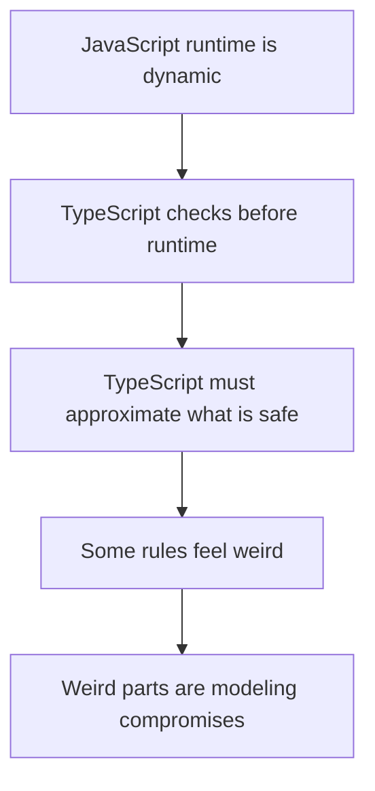
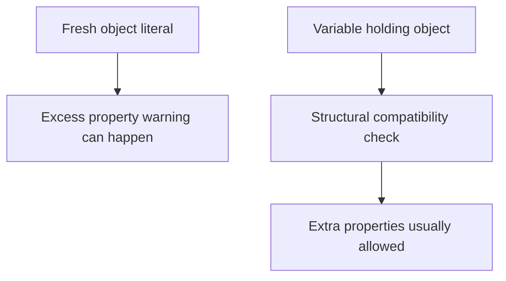

# TypeScript Chapter 12: Weird Parts Review

> Syntax is not knowledge. Mental models are knowledge.

This note is a reading-preview note before active recall. The goal is not to memorize weird TypeScript rules one by one. The goal is to see the deeper reason they exist.

## Where You Are

You already worked through:

- Chapter 10: Deriving Types
- Chapter 11: Annotations and Assertions
- The beginning of Chapter 12: The Weird Parts

The important ideas already on the table are:

- Value world vs type world
- `typeof`
- `keyof`
- `ReturnType`
- `Parameters`
- literal types
- `as const`
- `satisfies`
- fresh vs stale objects
- open object types
- `never`
- optional properties

## The Core Mental Model

TypeScript is not trying to describe JavaScript as a perfectly closed mathematical system.

TypeScript is trying to safely model real JavaScript.

That matters because JavaScript is dynamic:

- objects can have extra properties
- keys are runtime strings
- `this` depends on how a function is called
- functions can be passed around freely
- runtime values and compile-time types are separate worlds

So many "weird parts" are not random. They are compromises between:

1. JavaScript runtime flexibility
2. TypeScript compile-time safety
3. existing JavaScript patterns that TypeScript must support

## The Big Picture



## Runtime vs Compile Time

The most important split:

| World | Exists when? | Contains | Example |
|---|---:|---|---|
| Value world | Runtime | real JavaScript values | `const user = { name: "Max" }` |
| Type world | Type checking | static descriptions | `type User = { name: string }` |

TypeScript checks your code before it runs. After compilation, most type information is gone.

That means a type is not the object itself. A type is a promise about how the object can be safely used.

## Open Object Types

### The problem

JavaScript objects often contain more data than one part of the program cares about.

Example:

```ts
type User = {
  name: string
}

const data = {
  name: "Max",
  age: 30
}

const user: User = data
```

This does not error because `data` has at least what `User` requires.

### The mental model

> Object types in TypeScript are usually minimum requirements, not exact object locks.

`User` says:

```text
I need a name property that is a string.
```

It does not say:

```text
This object must have only name and nothing else.
```

## Fresh vs Stale Objects

### Fresh object

An object literal written directly in a place where TypeScript knows the target type is "fresh".

```ts
type User = {
  name: string
}

const user: User = {
  name: "Max",
  age: 30
}
```

Here TypeScript can warn:

```text
You are creating a User right here, and age is not part of User.
```

### Stale object

Once the object is stored in a variable first, TypeScript treats it more like a normal JavaScript object.

```ts
type User = {
  name: string
}

const data = {
  name: "Max",
  age: 30
}

const user: User = data
```

This is allowed because `data` is structurally compatible with `User`.

### The pattern



## Literal Types and `as const`

### The problem

Sometimes TypeScript widens a specific value into a broader type.

```ts
const role = "admin"
```

The type is:

```ts
"admin"
```

But inside an object:

```ts
const user = {
  role: "admin"
}
```

The type of `user.role` is usually:

```ts
string
```

Why? Because object properties are assumed to be changeable unless TypeScript is told otherwise.

```ts
user.role = "editor"
```

So TypeScript widens `"admin"` to `string`.

### `as const`

```ts
const user = {
  role: "admin"
} as const
```

Now `user.role` is:

```ts
"admin"
```

The object becomes deeply readonly, and TypeScript keeps the narrow literal value.

## Optional Properties

```ts
type User = {
  name?: string
}

declare const user: User
```

The type of:

```ts
user.name
```

is not just:

```ts
string
```

It is:

```ts
string | undefined
```

Because `name?: string` means:

```text
The property may be missing.
If it exists, it should be a string.
```

Reading an optional property must include the missing case.

## Object Keys Are Loosely Typed

`Object.keys(obj)` often returns:

```ts
string[]
```

not:

```ts
(keyof T)[]
```

Why?

Because at runtime, the object may contain more keys than its static type says.

```ts
type User = {
  name: string
}

const data = {
  name: "Max",
  age: 30
}

const user: User = data

Object.keys(user)
```

At runtime, the keys can include:

```ts
["name", "age"]
```

But statically, `keyof User` is only:

```ts
"name"
```

This is why TypeScript stays conservative.

## `never`

`never` means:

```text
This state should not be possible.
```

It often appears when TypeScript has eliminated every possible case.

Example:

```ts
type Role = "admin" | "user"

function handleRole(role: Role) {
  if (role === "admin") {
    return "Admin"
  }

  if (role === "user") {
    return "User"
  }

  role
}
```

At the end, `role` is `never` because all valid cases have already been handled.

## What Chapter 12 Is Really Teaching

Chapter 12 is teaching you to ask:

```text
What JavaScript reality is TypeScript trying to model here?
```

When something feels weird, do not only memorize the rule.

Ask:

1. Is this runtime or compile time?
2. Is TypeScript checking a fresh object or a stale object?
3. Is this object type open or exact?
4. Can the runtime value have more information than the static type?
5. Is the value mutable, so TypeScript widens it?
6. Is TypeScript protecting me from a missing case?

## Beginner Traps

| Beginner mental model | Better mental model |
|---|---|
| A type describes the exact object. | A type usually describes the minimum safe shape. |
| `name?: string` means `name` is a string. | It means `name` may be missing, so reading it gives `string | undefined`. |
| `Object.keys` should know exact keys. | Runtime objects can have more keys than the static type says. |
| `as const` is just a syntax trick. | It tells TypeScript to preserve literal values and readonly structure. |
| `never` is a strange type. | `never` means no possible value remains. |

## Active Recall Preview

Try these after reading the note once.

1. What is the type of `role`?

```ts
const role = "admin"
```

2. What is the type of `user.role`?

```ts
const user = {
  role: "admin"
}
```

3. What is the type of `user.role` now?

```ts
const user = {
  role: "admin"
} as const
```

4. Why is there no error here?

```ts
type User = {
  name: string
}

const data = {
  name: "Max",
  age: 30
}

const user: User = data
```

5. Why is `user.name` not simply `string`?

```ts
type User = {
  name?: string
}

declare const user: User
```

## Practice Task

Explain this sentence in your own words:

> TypeScript object types are usually open, and excess property warnings are a special check for fresh object literals.

If you can explain that without saying "because TypeScript is weird", Chapter 12 is starting to click.

## Summary

The weird parts are mostly not random.

They come from TypeScript trying to safely check JavaScript without pretending JavaScript is stricter than it really is.

The strongest mental model:

> TypeScript checks a static approximation of runtime JavaScript. Weird parts appear where the approximation has to stay flexible.
